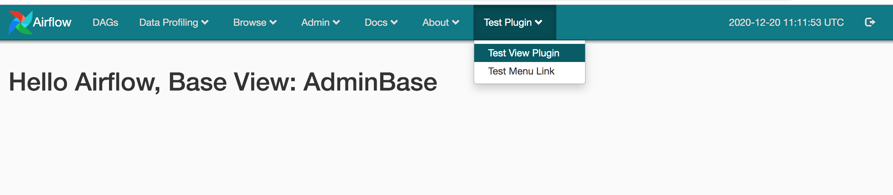
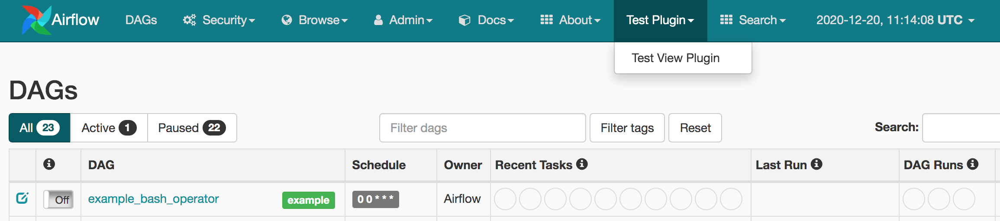

# Airflow_Plugin_Tutorial
This a simple airflow plugin example. You can just copy the `plugins` folder under `AIRFLOW_HOME`,
then start the webserver. The website will show the `Test Plugin` in the navigation bar.

# Airflow Screen Shot

